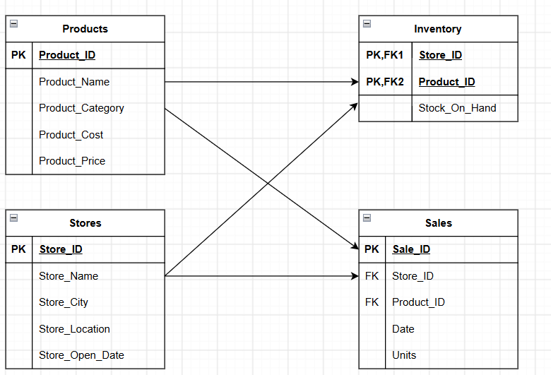

# **Mexico Toys Stores Analysis**

# **1. Project Background**

Maven Toys is a multi-store toy retailer operating **50 stores across multiple locations** and offering a diverse range of toy products across several categories. The business generates revenue through in-store sales, making store performance, product demand, profitability, and inventory availability important factors in maintaining sustainable sales growth.

From a Data Analyst perspective, this project aims to evaluate the company's sales performance across **2022 and the first nine months of 2023**. The analysis focuses on revenue and order trends, Average Order Value (AOV), revenue distribution across locations and product categories, store-level and category-level profitability, and potential inventory risks associated with high-demand products.

The analysis covers **full-year 2022 and the first nine months of 2023**, using transaction-level sales data together with product, store, and inventory information. Insights and recommendations are provided across the following key business areas:

- **Sales Performance:** Revenue and order trends over time
- **Location Performance:** Revenue contribution and geographic concentration
- **Product & Profitability:** Category revenue and store-level profit margins
- **Inventory Health:** Stock levels relative to historical sales demand

The analysis was conducted using **Microsoft Excel, Power Query, PivotTables, PivotCharts, and interactive slicers**. The final dashboard was developed to allow stakeholders to explore sales performance across different time periods, locations, and product categories.

---
# **2. Project Files**
### Dataset 
- 📊 [Raw Data & Data dictionary](Dataset.xlsx)

### Dashboard
- 🖥️ [Excel Dashboard(Sheet 4)](Pivot_Dashboard.xlsx)

### Power Query and Pivot Table Processing 
- ⚙️ [Power Query](Power_Query.xlsx)
- 📋 [Pivot table (Sheet 3)](Pivot_Dashboard.xlsx)
### Images
- 🗺️ [ERD](Images/ERD.png)
- 🖥️ [Dashboard](Images/Dashboard.png)
---

# **3. Data Structure Overview**
The dataset consists of five tables:

- **Products** – Contains product-level information, including product names and categories.
- **Stores** – Contains store-level information, including store names and locations.
- **Inventory** – Contains inventory information, including stock levels by product and store
- **Sales** – Contains transaction-level sales data, including sales dates, products, stores, and units sold
- **Data_dictionary** – Provides detailed definitions and descriptions of the fields contained in the datasets.

Here is the ERD:

---

# **4. Executive Summary**

### **Overview of Findings**

  

The business demonstrated **stronger sales performance in the first nine months of 2023**, with total revenue increasing by approximately **31%** and order volume increasing by **37.5%** compared with the same period in 2022. However, revenue remained highly concentrated in **Downtown, which contributed more than 56% of total revenue**, while Toys continued to be the largest revenue-generating category despite having substantially lower profit margins than Electronics.

From an operational perspective, the findings highlight two key areas requiring attention: **improving revenue per transaction as AOV declined despite higher order volume**, and **managing inventory risk among high-demand products with relatively low stock-to-sales ratios**. Together, these findings suggest that future growth should focus not only on increasing sales volume, but also on improving profitability, transaction value, and inventory efficiency.

---
# **5. Insights Deep Dive**

## **5.1. Sales Performance**

  

- **Revenue remained consistently higher in 2023 during the first nine months.** Every month from January to September recorded higher revenue than the corresponding month in 2022. Revenue also remained relatively stable throughout Q2(April - June), while November and December 2022 showed a noticeable increase in year-end sales activity.

- **Order growth outpaced revenue growth in the first nine months of 2023.** Compared with the same period in 2022, the number of orders increased by approximately **37.5%**, while revenue increased by approximately **31%**. At the same time, Average Order Value (AOV) decreased from **\$17.91 in 2022** to **$17.05 in 2023**, indicating that revenue growth was primarily driven by higher transaction volume rather than higher spending per order.

## **5.2. Location Performance**

  

- **Downtown remained the dominant revenue-generating location.** Downtown contributed approximately **56.5% of total revenue in full-year 2022 and 57.4% during the first nine months of 2023**, while Airport and Residential contributed only approximately **8–12% each**. This indicates a high concentration of revenue in Downtown.

- **The overall revenue mix across locations remained stable.** The ranking of locations was unchanged between the two periods, with Downtown followed by Commercial, Residential, and Airport. Each location's revenue share changed by  approximately **1 percentage point**, suggesting that the underlying geographic revenue mix remained relatively consistent.

## **5.3. Category & Profitability**

  
  

- **Toys was the highest-revenue category in both periods.** Toys generated approximately **\$2.79M in full-year 2022** and **$2.30M during the first nine months of 2023**, representing approximately **37% and 33% of total revenue**, respectively.

- Among the top 10 stores by overall profit margin, Electronics consistently achieved the highest category-level margins, ranging from approximately **43–53%**, while Toys had the lowest margins at approximately **20–25%**. Despite Toys generating the highest revenue among the five categories, its lower margin indicates that revenue contribution does not necessarily translate into stronger profitability.

## **5.4. Product & Inventory**

  

- **Art & Crafts and Toys showed the strongest product-level demand.** Six of the ten best-selling products belonged to **Art & Crafts and Toys**, with **three products** from each category. This indicates that their strong category-level performance is supported by multiple high-volume products rather than being driven by a single product.

- **Several best-selling products have relatively low remaining stock compared with their sales volume.** Among the top 10 best-selling products, **Action Figure and Colorbuds had the lowest stock-to-sales ratios at 1.06% and 1.11%**, respectively, despite selling approximately **58K and 104K units**. These products should be prioritized for inventory monitoring and potential replenishment.
---
# **6 .Recommendations**

Based on the insights and findings above, the following recommendations are proposed:

## **6.1. Sales Performance**

- **Increase Average Order Value (AOV).** Since order volume grew faster than revenue while AOV declined, the business should focus on increasing the value of each transaction through **product bundling, cross-selling, and complementary-product recommendations**.

## **6.2. Location Performance**

- **Develop location-specific sales strategies.** Rather than applying the same strategy across all stores, management should identify the **best-performing products and categories within each location** and use these patterns to develop targeted promotions and product assortments.

- **Use Downtown as a benchmark for other locations.** Since Downtown consistently generates the majority of revenue, its **category performance and sales patterns** could be compared with lower-performing locations to identify practices that may be transferable.

## **6.3. Category & Profitability**

- **Prioritize profitable growth rather than revenue growth alone.** Product and category decisions should consider **both revenue contribution and profit margin**, particularly when allocating promotional resources or prioritizing product categories.

- Since Electronics shows substantially higher margins than other categories, management should examine its **pricing, cost structure, and product mix** to determine whether similar practices could be applied to other categories.

## **6.4. Product & Inventory**

- **Prioritize replenishment for high-demand, low-stock products.** Products such as **Action Figure and Colorbuds** should receive higher replenishment priority because of their combination of strong sales volume and low stock-to-sales ratios.

- **Allocate inventory based on store-level demand.** Replenishment should consider **where products are selling most actively**, rather than distributing inventory evenly across stores. This can help reduce the risk of shortages in high-demand locations while avoiding unnecessary stock accumulation elsewhere.
